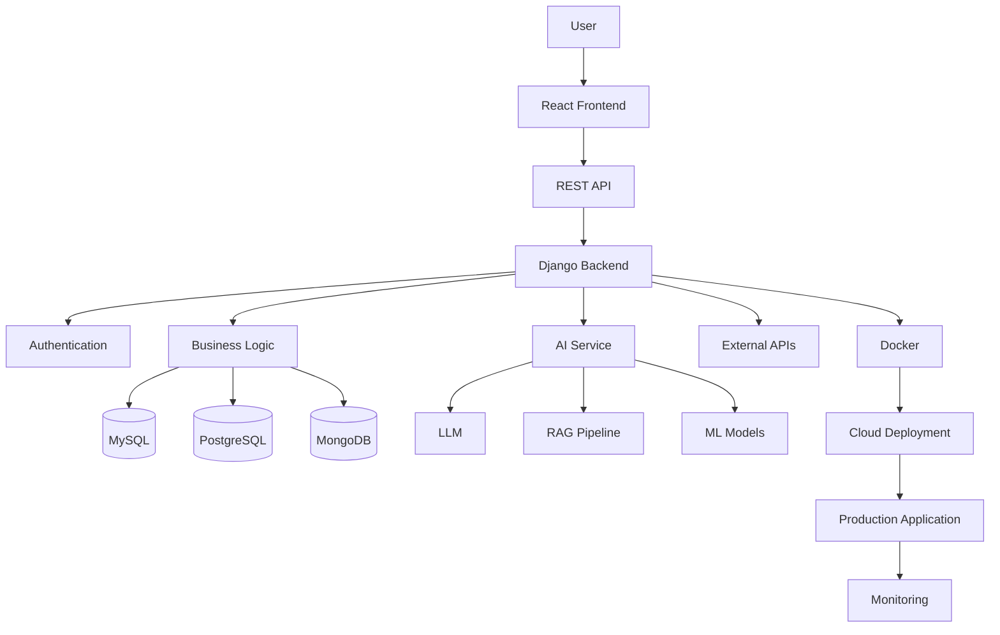

<h1 align="center">Hi 👋, I'm Dinesh Gaikwad</h1>

<h3 align="center">
Full-Stack AI Engineering Developer | Software Engineer | Python | C++ | Java | Django | React | AI/ML
</h3>

<p align="center">
  
</p>

<p align="center">
  
</p>

---

## 🚀 About Me

I am a **Full-Stack AI Engineering Developer** focused on building
real-world, scalable and production-oriented applications.

My engineering journey combines:

- 💻 Programming
- 🧠 Data Structures & Algorithms
- 🌐 Full-Stack Development
- ⚙️ Backend Engineering
- 🤖 Artificial Intelligence
- 🗄️ Database Engineering
- ☁️ Cloud & Deployment
- 🏗️ System Design

> **I don't just write code — I focus on understanding the complete system behind the code.**

---

## 📊 Developer Snapshot

<p align="center">


</p>

<p align="center">


</p>

---

# 🧠 My Engineering Identity

```text
                         REAL WORLD PROBLEM
                                │
                                ▼
                         REQUIREMENTS
                                │
                                ▼
                          SYSTEM DESIGN
                                │
              ┌─────────────────┼─────────────────┐
              │                 │                 │
              ▼                 ▼                 ▼
          FRONTEND           BACKEND              AI
           React             Django              LLM
           UI/UX             REST API             RAG
           Dashboard         Auth                 ML
              │                 │                 │
              └─────────────────┼─────────────────┘
                                │
                                ▼
                            DATABASE
                                │
                                ▼
                         TESTING & SECURITY
                                │
                                ▼
                         DOCKER / CLOUD
                                │
                                ▼
                       PRODUCTION SYSTEM
````

---

# 🛠️ Tech Stack

<p align="center">
  
</p>

### 💻 Programming

```text
Python       ████████████████████
C++          ████████████████
Java         ███████████████
```

### 🌐 Full Stack

* React.js
* JavaScript
* HTML5
* CSS3
* Django
* REST API
* Responsive Web Applications

### ⚙️ Backend

* Python
* Django
* Django REST Framework
* REST API
* JWT
* OAuth2
* RBAC
* Authentication
* Authorization

### 🤖 AI Engineering

* Artificial Intelligence
* Machine Learning
* Generative AI
* LLM Applications
* RAG
* NLP
* AI Automation
* AI-powered APIs

### 🗄️ Database

* MySQL
* PostgreSQL
* MongoDB
* Database Design
* Query Optimization

### ☁️ Cloud / DevOps

* Azure
* Docker
* Kubernetes
* Git
* GitHub
* Linux
* CI/CD

---

# 🏗️ AI + Full-Stack Architecture



---

# 💼 Experience

## 🚀 15+ Months Development Experience

My development experience is focused on:

```text
Programming
     ↓
DSA
     ↓
Backend Development
     ↓
Full-Stack Development
     ↓
AI Engineering
     ↓
Database Engineering
     ↓
Cloud / Deployment
     ↓
Production Systems
```

---

# 🏢 Internship Experience

## 4 Internships

| #  | Role                         | Organization | Focus           |
| -- | ---------------------------- | ------------ | --------------- |
| 01 | Software / Full-Stack Intern | YOUR COMPANY | Full Stack      |
| 02 | AI / ML Intern               | YOUR COMPANY | AI / ML         |
| 03 | Backend Intern               | YOUR COMPANY | Backend / API   |
| 04 | AI Engineering Intern        | YOUR COMPANY | AI + Full Stack |

> Replace `YOUR COMPANY` with your actual internship organizations.

---

# 🚀 Major Project

## 🧠 AI-Powered Full-Stack Platform

### 🎯 Problem

Building a complete platform that combines modern web development,
backend APIs, databases and AI into a single production-ready system.

### 💡 Solution

```text
React
  ↓
REST API
  ↓
Django
  ↓
Authentication
  ↓
Business Logic
  ↓
Database
  ↓
AI / LLM
  ↓
Docker
  ↓
Cloud
```

### 🔥 Key Capabilities

* AI-powered features
* User authentication
* Role-based access
* REST APIs
* Database management
* Dashboard
* Notifications
* AI integration
* Cloud deployment
* Production-ready architecture

### 📌 Project Information

| Feature    | Details                |
| ---------- | ---------------------- |
| Duration   | **1 Month**            |
| Frontend   | **React.js**           |
| Backend    | **Django / Python**    |
| Database   | **MySQL / PostgreSQL** |
| AI         | **LLM / ML / RAG**     |
| Deployment | **Docker / Cloud**     |

🔗 **GitHub:** `YOUR_PROJECT_GITHUB_LINK`

🌐 **Live Demo:** `YOUR_LIVE_PROJECT_LINK`

---

# 📚 22 Repository Portfolio

> Each repository represents a major development project.

|  # | Repository   | Project                     | Duration | Skills              | Links                   |
| -: | ------------ | --------------------------- | -------- | ------------------- | ----------------------- |
| 01 | `project-01` | AI Web Application          | 1 Month  | Python, AI, React   | [GitHub](#) | [Live](#) |
| 02 | `project-02` | Full-Stack AI Assistant     | 1 Month  | Django, React, LLM  | [GitHub](#) | [Live](#) |
| 03 | `project-03` | AI Document Analyzer        | 1 Month  | Python, NLP, AI     | [GitHub](#) | [Live](#) |
| 04 | `project-04` | AI Resume Analyzer          | 1 Month  | Python, NLP, React  | [GitHub](#) | [Live](#) |
| 05 | `project-05` | AI Interview Platform       | 1 Month  | LLM, API, React     | [GitHub](#) | [Live](#) |
| 06 | `project-06` | E-Commerce Platform         | 1 Month  | React, Django, SQL  | [GitHub](#) | [Live](#) |
| 07 | `project-07` | Real-Time Chat App          | 1 Month  | React, WebSocket    | [GitHub](#) | [Live](#) |
| 08 | `project-08` | AI Content Generator        | 1 Month  | Python, LLM         | [GitHub](#) | [Live](#) |
| 09 | `project-09` | ML Prediction System        | 1 Month  | Python, ML          | [GitHub](#) | [Live](#) |
| 10 | `project-10` | Recommendation Engine       | 1 Month  | ML, Python, DB      | [GitHub](#) | [Live](#) |
| 11 | `project-11` | Authentication Platform     | 1 Month  | JWT, RBAC, Django   | [GitHub](#) | [Live](#) |
| 12 | `project-12` | Developer Productivity Tool | 1 Month  | Python, APIs        | [GitHub](#) | [Live](#) |
| 13 | `project-13` | RAG Knowledge System        | 1 Month  | LLM, RAG, Vector DB | [GitHub](#) | [Live](#) |
| 14 | `project-14` | Intelligent Search Engine   | 1 Month  | NLP, Python         | [GitHub](#) | [Live](#) |
| 15 | `project-15` | Analytics Dashboard         | 1 Month  | React, Python       | [GitHub](#) | [Live](#) |
| 16 | `project-16` | AI Automation Platform      | 1 Month  | Python, AI, APIs    | [GitHub](#) | [Live](#) |
| 17 | `project-17` | Java Backend System         | 1 Month  | Java, REST, SQL     | [GitHub](#) | [Live](#) |
| 18 | `project-18` | C++ Algorithm Project       | 1 Month  | C++, DSA            | [GitHub](#) | [Live](#) |
| 19 | `project-19` | Cloud AI Application        | 1 Month  | Docker, Cloud, AI   | [GitHub](#) | [Live](#) |
| 20 | `project-20` | AI Data Pipeline            | 1 Month  | Python, ETL, AI     | [GitHub](#) | [Live](#) |
| 21 | `project-21` | Production AI System        | 1 Month  | Full Stack, AI      | [GitHub](#) | [Live](#) |
| 22 | `project-22` | AI Engineering Capstone     | 1 Month  | AI, React, Cloud    | [GitHub](#) | [Live](#) |

---

# 🧠 DSA Journey

<p align="center">


</p>

### 🔥 Problem Solving

```text
Understand Problem
       ↓
Find Pattern
       ↓
Brute Force
       ↓
Optimize
       ↓
Time Complexity
       ↓
Space Complexity
       ↓
Code
       ↓
Test Edge Cases
       ↓
Submit
       ↓
Learn
```

### 🧩 DSA Topics

* Arrays
* Strings
* Hashing
* Two Pointers
* Sliding Window
* Linked List
* Stack
* Queue
* Binary Search
* Trees
* Graphs
* Recursion
* Backtracking
* Greedy
* Dynamic Programming
* Sorting
* Searching

---

# 📊 GitHub Statistics

<p align="center">


</p>

<p align="center">


</p>

---

# 🐍 Contribution Snake Animation

<p align="center">


</p>

---

# 📈 GitHub Activity Graph

<p align="center">


</p>

---

# 🔥 GitHub Contribution Activity

```text
╔══════════════════════════════════════════════════╗
║             DEVELOPER ACTIVITY                   ║
╠══════════════════════════════════════════════════╣
║                                                  ║
║  🟩 Active Coding Days        40+                ║
║  📈 Contributions             138+               ║
║  📦 Repositories              22                 ║
║  💻 Primary Focus             AI + Full Stack    ║
║                                                  ║
╚══════════════════════════════════════════════════╝
```

---

# 📊 Developer Dashboard

```text
╔══════════════════════════════════════════════════════╗
║              DINESH GAIKWAD                         ║
║           FULL-STACK AI ENGINEER                    ║
╠══════════════════════════════════════════════════════╣
║                                                      ║
║  GitHub Repositories        22                       ║
║  GitHub Contributions       138+                     ║
║  Active Coding Days         40+                      ║
║                                                      ║
║  LeetCode Problems          620+                     ║
║  LeetCode Rank              131013                   ║
║                                                      ║
║  Programming                Python / C++ / Java      ║
║  Experience                 15+ Months               ║
║  Internships                4                        ║
║  Certifications             20                       ║
║                                                      ║
║  Education                  BCS                      ║
║  Graduation                 2026                     ║
║  Academic Score             76%                      ║
║                                                      ║
║  LinkedIn Network           1300+                    ║
║                                                      ║
╚══════════════════════════════════════════════════════╝
```

---

# 📜 Certifications

## 🏅 20 Professional Certifications

|  # | Certification        | Provider | Verification |
| -: | -------------------- | -------- | ------------ |
| 01 | `Certification Name` | Provider | [Verify](#)  |
| 02 | `Certification Name` | Provider | [Verify](#)  |
| 03 | `Certification Name` | Provider | [Verify](#)  |
| 04 | `Certification Name` | Provider | [Verify](#)  |
| 05 | `Certification Name` | Provider | [Verify](#)  |
| 06 | `Certification Name` | Provider | [Verify](#)  |
| 07 | `Certification Name` | Provider | [Verify](#)  |
| 08 | `Certification Name` | Provider | [Verify](#)  |
| 09 | `Certification Name` | Provider | [Verify](#)  |
| 10 | `Certification Name` | Provider | [Verify](#)  |
| 11 | `Certification Name` | Provider | [Verify](#)  |
| 12 | `Certification Name` | Provider | [Verify](#)  |
| 13 | `Certification Name` | Provider | [Verify](#)  |
| 14 | `Certification Name` | Provider | [Verify](#)  |
| 15 | `Certification Name` | Provider | [Verify](#)  |
| 16 | `Certification Name` | Provider | [Verify](#)  |
| 17 | `Certification Name` | Provider | [Verify](#)  |
| 18 | `Certification Name` | Provider | [Verify](#)  |
| 19 | `Certification Name` | Provider | [Verify](#)  |
| 20 | `Certification Name` | Provider | [Verify](#)  |

---

# 🎓 Education

## Bachelor of Computer Science — BCS

### VNM College | BAMU

```text
Degree       : Bachelor of Computer Science
College      : VNM College
University   : BAMU
Duration     : 2023 – 2026
Graduation   : 2026
Score        : 76%
```

---

# 📚 Currently Learning

```text
Advanced Django
       ↓
System Design
       ↓
Microservices
       ↓
Database Scaling
       ↓
API Optimization
       ↓
LLM Applications
       ↓
RAG Architecture
       ↓
Cloud Deployment
       ↓
Production AI Engineering
```

---

# 🎯 2026 Engineering Goals

* 🚀 Build production-grade AI applications
* 🧠 Master System Design
* ⚙️ Build scalable backend systems
* 🤖 Build advanced LLM/RAG applications
* ☁️ Improve cloud engineering
* 🗄️ Master database optimization
* 🧩 Continue DSA problem solving
* 🌍 Contribute to open-source projects
* 💼 Become a strong Full-Stack AI Engineer

---

# 🏆 Achievement Matrix

| Area                     |             Achievement |
| ------------------------ | ----------------------: |
| 🟩 GitHub Active Days    |                 **40+** |
| 📈 GitHub Contributions  |                **138+** |
| 📦 GitHub Repositories   |                  **22** |
| 🧠 LeetCode Problems     |                **620+** |
| 🏆 LeetCode Rank         |             **131,013** |
| 💻 Programming Languages | **Python • C++ • Java** |
| 💼 Experience            |          **15+ Months** |
| 🏢 Internships           |                   **4** |
| 📜 Certifications        |                  **20** |
| 🔗 LinkedIn              |              **1,300+** |
| 🎓 BCS Score             |                 **76%** |

---

# 💡 Engineering Philosophy

> ## "Discipline + Problem Solving + Real Projects + System Thinking = Engineering Growth"

```text
LEARN
  ↓
BUILD
  ↓
BREAK
  ↓
DEBUG
  ↓
OPTIMIZE
  ↓
TEST
  ↓
DEPLOY
  ↓
DOCUMENT
  ↓
REPEAT
```

---

# 👀 For Recruiters

### Don't judge the profile only by numbers.

Look at the complete engineering journey:

```text
             620+ DSA PROBLEMS
                     │
                     ▼
              PROGRAMMING
          Python / C++ / Java
                     │
                     ▼
           FULL-STACK DEVELOPMENT
             React + Backend + DB
                     │
                     ▼
              AI ENGINEERING
             ML + LLM + RAG
                     │
                     ▼
              SYSTEM DESIGN
                     │
                     ▼
             CLOUD / DEVOPS
                     │
                     ▼
          PRODUCTION APPLICATIONS
                     │
                     ▼
          FULL-STACK AI ENGINEER
```

### 🔥 What I Bring

**Problem Solving + Full-Stack Development + Backend Engineering + AI + System Thinking**

---

# 🤝 Connect With Me

<p align="center">

<a href="https://github.com/Dinesh-gaikwad">

</a>

<a href="https://www.linkedin.com/in/dinesh-gaikwad-3033b319/">

</a>

<a href="mailto:gaikwaddinesh0503@gmail.com">

</a>

<a href="https://leetcode.com/">

</a>

</p>

---

# 🚀 Let's Build Something Intelligent

<p align="center">

### 💻 Build Systems

### 🤖 Build Intelligence

### ☁️ Deploy at Scale

### 🧠 Keep Learning

</p>

---

<p align="center">


</p>

<p align="center">
<strong>Full-Stack AI Engineering Developer</strong><br/>
Python • C++ • Java • Django • React • AI • DSA • Cloud
</p>
```
