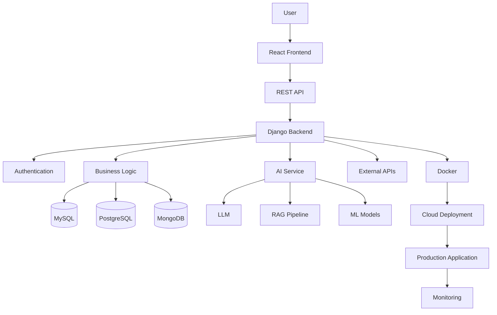

<h1 align="center">👋 Hi, I'm Dinesh Gaikwad</h1>

<h3 align="center">
Full-Stack AI Engineering Developer | Software Engineer
</h3>

<p align="center">
Python • C++ • Java • Django • React • AI/ML • DSA • Cloud
</p>

<p align="center">
  
</p>

<p align="center">
  
</p>

---

# 🚀 About Me

I am a **Full-Stack AI Engineering Developer** focused on building practical, scalable and production-oriented software systems.

My engineering journey combines:

* 💻 Programming & Software Engineering
* 🧠 Data Structures & Algorithms
* 🌐 Full-Stack Web Development
* ⚙️ Backend & API Engineering
* 🤖 Artificial Intelligence & Machine Learning
* 🧠 LLM & RAG Applications
* 🗄️ Database Engineering
* ☁️ Cloud & DevOps
* 🏗️ System Design

> **I don't just write code — I focus on understanding the complete system behind the code.**

---

# 📊 Developer Snapshot

<p align="center">


</p>

<p align="center">


</p>

---

# 🧠 Engineering Identity

```text
                         REAL-WORLD PROBLEM
                                  │
                                  ▼
                            REQUIREMENTS
                                  │
                                  ▼
                            SYSTEM DESIGN
                                  │
             ┌────────────────────┼────────────────────┐
             │                    │                    │
             ▼                    ▼                    ▼
         FRONTEND              BACKEND                AI
          React                Django                 LLM
          UI/UX                REST API               RAG
          Dashboard            Auth                   ML
             │                    │                    │
             └────────────────────┼────────────────────┘
                                  │
                                  ▼
                              DATABASE
                                  │
                                  ▼
                         TESTING & SECURITY
                                  │
                                  ▼
                           DOCKER / CLOUD
                                  │
                                  ▼
                         PRODUCTION SYSTEM
```

---

# 🛠️ Tech Stack

<p align="center">

</p>

### 💻 Programming

* Python
* C++
* Java

### 🌐 Frontend

* React.js
* JavaScript
* HTML5
* CSS3
* Responsive Web Applications
* UI/UX Development

### ⚙️ Backend

* Python
* Django
* Django REST Framework
* REST APIs
* JWT
* OAuth2
* RBAC
* Authentication & Authorization

### 🤖 AI Engineering

* Artificial Intelligence
* Machine Learning
* Generative AI
* Large Language Models
* RAG
* NLP
* AI Automation
* AI-powered APIs

### 🗄️ Database

* MySQL
* PostgreSQL
* MongoDB
* Database Design
* Query Optimization

### ☁️ Cloud & DevOps

* Microsoft Azure
* Docker
* Kubernetes
* Git
* GitHub
* Linux
* CI/CD

---

# 🏗️ AI + Full-Stack Architecture



---

# 💼 Engineering Experience

### 15+ Months Development Experience

```text
Programming
     ↓
DSA
     ↓
Backend Development
     ↓
Full-Stack Development
     ↓
AI Engineering
     ↓
Database Engineering
     ↓
Cloud / DevOps
     ↓
Production Systems
```

---

# 🏢 Internship Experience

|  # | Role                         | Organization  | Focus           |
| -: | ---------------------------- | ------------- | --------------- |
| 01 | Software / Full-Stack Intern | To be updated | Full Stack      |
| 02 | AI / ML Intern               | To be updated | AI / ML         |
| 03 | Backend Intern               | To be updated | Backend / APIs  |
| 04 | AI Engineering Intern        | To be updated | AI + Full Stack |

---

# 🚀 Featured Project

## 🧠 AI-Powered Full-Stack Platform

A full-stack platform combining modern web development, backend engineering, databases and AI.

### Architecture

```text
React
  ↓
REST API
  ↓
Django
  ↓
Authentication
  ↓
Business Logic
  ↓
Database
  ↓
AI / LLM / RAG
  ↓
Docker
  ↓
Cloud
  ↓
Production
```

### 🔥 Key Capabilities

* 🤖 AI-powered features
* 🔐 User authentication
* 👥 Role-based access
* 🔌 REST APIs
* 🗄️ Database management
* 📊 Dashboard
* 🔔 Notifications
* 🧠 AI integration
* ☁️ Cloud deployment
* 🏗️ Production-oriented architecture

---

# 📦 Project Portfolio

|  # | Project                           | Technologies               | Duration | GitHub                                                                                   | Live Demo                                                   |
| -: | --------------------------------- | -------------------------- | -------- | ---------------------------------------------------------------------------------------- | ----------------------------------------------------------- |
| 01 | **EduCareerVerse**                | Python, AI, React, Node.js | 1 Month  | [GitHub](https://github.com/dinesh-gaikwad/educareerverse)                               | [Live](https://educareerverse-1.onrender.com/)              |
| 02 | **Neuro Arcade X**                | Python, React              | 1 Month  | [GitHub](https://github.com/dinesh-gaikwad/Full-stack-python-project-.git)               | [Live](https://full-stack-python-project.onrender.com/)     |
| 03 | **StudySync AI**                  | Node.js, React, Express.js | 1 Month  | [GitHub](https://github.com/dinesh-gaikwad/studysync-ai.git)                             | [Live](https://studysync-ai-1.onrender.com/)                |
| 04 | **Indian Gamer Hub**              | Node.js, React             | 1 Month  | [GitHub](https://github.com/dinesh-gaikwad/indiangamehub.git)                            | [Live](https://indiangamehub.onrender.com/)                 |
| 05 | **Budget Utilization Monitoring** | React, Node.js, Python     | 1 Month  | [GitHub](https://github.com/dineshgaikwad0503-ship-it/budget-utilization-monitoring.git) | [Live](https://budget-utilization-monitoring.onrender.com/) |
| 06 | **E-Commerce Platform**           | python,flask,react         | 1 Month  | [GitHub](https://github.com/dinesh-gaikwad/e-commerce-platform)                                                                              | [Live](https://e-commerce-platform-yyfq.onrender.com/)                                                   |
| 07 | **schoolefacaltyportal**            |react,node,flask           | 1 Month  | [GitHub](https://github.com/dinesh-gaikwad/SchoolFacilityPortal.git)                                                                              | [Live](https://schoolfacilityportal.onrender.com)                                                   |
| 08 | **AI Content Generator**          | Python, LLM                | 1 Month  | [GitHub](#)                                                                              | [Live](#)                                                   |
| 09 | **ML Prediction System**          | Python, ML                 | 1 Month  | [GitHub](#)                                                                              | [Live](#)                                                   |
| 10 | **Recommendation Engine**         | ML, Python, DB             | 1 Month  | [GitHub](#)                                                                              | [Live](#)                                                   |
| 11 | **Authentication Platform**       | JWT, RBAC, Django          | 1 Month  | [GitHub](#)                                                                              | [Live](#)                                                   |
| 12 | **Developer Productivity Tool**   | Python, APIs               | 1 Month  | [GitHub](#)                                                                              | [Live](#)                                                   |
| 13 | **RAG Knowledge System**          | LLM, RAG, Vector DB        | 1 Month  | [GitHub](#)                                                                              | [Live](#)                                                   |
| 14 | **Intelligent Search Engine**     | NLP, Python                | 1 Month  | [GitHub](#)                                                                              | [Live](#)                                                   |
| 15 | **Analytics Dashboard**           | React, Python              | 1 Month  | [GitHub](#)                                                                              | [Live](#)                                                   |
| 16 | **AI Automation Platform**        | Python, AI, APIs           | 1 Month  | [GitHub](#)                                                                              | [Live](#)                                                   |
| 17 | **Java Backend System**           | Java, REST, SQL            | 1 Month  | [GitHub](#)                                                                              | [Live](#)                                                   |
| 18 | **C++ Algorithm Project**         | C++, DSA                   | 1 Month  | [GitHub](#)                                                                              | [Live](#)                                                   |
| 19 | **Cloud AI Application**          | Docker, Cloud, AI          | 1 Month  | [GitHub](#)                                                                              | [Live](#)                                                   |
| 20 | **AI Data Pipeline**              | Python, ETL, AI            | 1 Month  | [GitHub](#)                                                                              | [Live](#)                                                   |
| 21 | **Production AI System**          | Full Stack, AI             | 1 Month  | [GitHub](#)                                                                              | [Live](#)                                                   |
| 22 | **AI Engineering Capstone**       | AI, React, Cloud           | 1 Month  | [GitHub](#)                                                                              | [Live](#)                                                   |

---

# 🧠 DSA Journey

<p align="center">


</p>

### 🔥 Problem-Solving Process

```text
Understand Problem
       ↓
Find Pattern
       ↓
Brute Force
       ↓
Optimize
       ↓
Time Complexity
       ↓
Space Complexity
       ↓
Code
       ↓
Test Edge Cases
       ↓
Submit
       ↓
Learn
```

### 🧩 Core DSA Topics

* Arrays
* Strings
* Hashing
* Two Pointers
* Sliding Window
* Linked Lists
* Stack
* Queue
* Binary Search
* Trees
* Graphs
* Recursion
* Backtracking
* Greedy Algorithms
* Dynamic Programming
* Sorting
* Searching

---

# 📊 GitHub Analytics

<p align="center">


</p>

<p align="center">


</p>

---

# 🐍 Contribution Snake

<p align="center">


</p>

---

# 📈 GitHub Activity Graph

<p align="center">


</p>

---

# 🏆 Achievement Matrix

| Area                      |             Achievement |
| ------------------------- | ----------------------: |
| 🟩 GitHub Active Days     |                 **40+** |
| 📈 GitHub Contributions   |                **138+** |
| 📦 GitHub Repositories    |                  **22** |
| 🧠 LeetCode Problems      |                **620+** |
| 💻 Programming            | **Python • C++ • Java** |
| 💼 Development Experience |          **15+ Months** |
| 🏢 Internships            |                   **4** |
| 📜 Certifications         |                 **20+** |
| 🎓 BCS Score              |                 **76%** |

---

# 📜 Certifications

|  # | Certification                             | Provider           | Verification                                                                                 |
| -: | ----------------------------------------- | ------------------ | -------------------------------------------------------------------------------------------- |
| 01 | Website Design and Development Internship | Internship-iStudio | [Verify](https://drive.google.com/file/d/1QRVBaMoZbCJgU4cLZSdq0skWIMAYHAZT/view?usp=sharing) |
| 02 | Website Design and Development Internship | iStudio            | [Verify](https://drive.google.com/file/d/1XqlH0lFWRf_CE3iOTajaCypBPMa1OoPI/view?usp=sharing) |
| 03 | CSS Code Generator Web App                | DIY Internship     | [Verify](https://drive.google.com/file/d/1gT9-DCj1FvB342I-hU0-eiugMwjw59ki/view?usp=sharing) |
| 04 | Interactive Pricing Tables                | DIY Internship     | [Verify](https://drive.google.com/file/d/1KNzeGvTot_uaBqWGeK6-S9DhxFrTQrs3/view?usp=sharing) |
| 05 | Google Analytics                          | Google             | [Verify](https://drive.google.com/file/d/1qIKmyJvQ2LE5T_P8jChBshhlD1F9n6i_/view?usp=sharing) |
| 06 | Machine Learning with Python              | Proudly Awarded    | [Verify](https://drive.google.com/file/d/1ClpHFxV0dIK84RKyofOHVOOaaxxyw9Rt/view?usp=sharing) |
| 07 | Git & GitHub                              | Proudly Awarded    | [Verify](https://drive.google.com/file/d/1hX9nWfKHjUPBuslPYdi5w9AJgaDWbyXH/view?usp=sharing) |
| 08 | DevOps                                    | Proudly Awarded    | [Verify](https://drive.google.com/file/d/1EViroOaYFqkQkSCo6-idwu7nhMhs7bPw/view?usp=sharing) |
| 09 | AWS Cloud Training + Internship           | AWS Cloud          | [Verify](https://drive.google.com/file/d/10eNSI1djdZshhDd8za7zw5M_VA5lxJxN/view?usp=sharing) |
| 10 | Data Science with Python                  | Cisco              | [Verify](https://drive.google.com/file/d/1K325BPp8FMctQ6SjqoWtAtCGtprbgxXi/view?usp=sharing) |
| 11 | Java Web Development                      | Study Section      | [Verify](https://drive.google.com/file/d/15BDub-WLvMmCR4QNZ1hvab2C9jmSRJvT/view?usp=sharing) |
| 12 | Computer Fundamentals                     | Study Section      | [Verify](https://drive.google.com/file/d/11KnWCwEdsPOmMfD5hXZJateoJfufh_iI/view?usp=sharing) |
| 13 | Full-Stack Development Internship         | Unified Mentor     | [Verify](https://drive.google.com/file/d/1uZDEY-3ZPq4rI1NGednnvYcc5pdYi2H5/view?usp=sharing) |
| 14 | Data Entry Operator                       | Tata Motors Ltd.   | [Verify](https://drive.google.com/file/d/1mOWwzXmu7Co6SHVDxZxllXEVG_zfIRxA/view?usp=sharing) |
| 15 | Spoken English Course                     | LearnVern          | [Verify](https://drive.google.com/file/d/1GakzRxSAWBINN9rshrMWP2xkCd51bWl4/view?usp=sharing) |
| 16 | Web Development Course + Internship       | Persevex           | [Verify](https://drive.google.com/file/d/1-jyToIdgt8ApeR6BtpaYfGCc4Wp2xoZt/view?usp=sharing) |
| 17 | Full-Stack Course                         | Navi-Tech          | [Verify](https://drive.google.com/file/d/1DgY-eagy6gW7RC5qlRmDUO7QSqnOhNEQ/view?usp=sharing) |
| 18 | Web Development Internship                | Persevex           | [Verify](https://drive.google.com/file/d/12De_gv0irBgCkMNfjESNa4Zslb9E5pX3/view?usp=sharing) |
| 19 | Full-Stack Development Internship         | Unified Mentor     | [Verify](https://drive.google.com/file/d/1ygkKUrezGKl6YtAtTvxHhWgLCofZ9szl/view?usp=sharing) |
| 20 | Legacy JavaScript in DSA v7               | freeCodeCamp       | [Verify](https://drive.google.com/file/d/1u0vIAF5Js8mz82ZKAJpF76W9rPeF1TcU/view?usp=sharing) |

> **Note:** The source file states 20+ certifications, while the detailed table provides 20 identifiable certificate entries.

---

# 🎓 Education

## Bachelor of Computer Science — BCS

**VNM College | BAMU**

| Detail         | Information                  |
| -------------- | ---------------------------- |
| Degree         | Bachelor of Computer Science |
| College        | VNM College                  |
| University     | BAMU                         |
| Duration       | 2023 – 2026                  |
| Graduation     | 2026                         |
| Academic Score | **76%**                      |

---

# 📚 Currently Learning

```text
Advanced Django
      ↓
System Design
      ↓
Microservices
      ↓
Database Scaling
      ↓
API Optimization
      ↓
LLM Applications
      ↓
RAG Architecture
      ↓
Cloud Deployment
      ↓
Production AI Engineering
```

---

# 🎯 2026 Engineering Goals

* 🚀 Build production-grade AI applications
* 🧠 Master System Design
* ⚙️ Build scalable backend systems
* 🤖 Build advanced LLM/RAG applications
* ☁️ Improve cloud engineering
* 🗄️ Master database optimization
* 🧩 Continue DSA problem solving
* 🌍 Contribute to open-source projects
* 💼 Become a strong Full-Stack AI Engineer

---

# 🏆 What I Bring

```text
Problem Solving
      +
Full-Stack Development
      +
Backend Engineering
      +
Artificial Intelligence
      +
Database Engineering
      +
Cloud / DevOps
      +
System Thinking
      =
FULL-STACK AI ENGINEERING
```

---

# 👀 For Recruiters

My profile represents an engineering journey across:

```text
              620+ DSA PROBLEMS
                       │
                       ▼
                  PROGRAMMING
               Python / C++ / Java
                       │
                       ▼
             FULL-STACK DEVELOPMENT
                React + Backend + DB
                       │
                       ▼
                 AI ENGINEERING
                  ML + LLM + RAG
                       │
                       ▼
                  SYSTEM DESIGN
                       │
                       ▼
                  CLOUD / DEVOPS
                       │
                       ▼
               PRODUCTION SYSTEMS
                       │
                       ▼
              FULL-STACK AI ENGINEER
```

### 🔥 Core Strengths

**Problem Solving + Full-Stack Development + Backend Engineering + AI + System Thinking**

---

# 💡 Engineering Philosophy

> **Discipline + Problem Solving + Real Projects + System Thinking = Engineering Growth**

```text
LEARN
  ↓
BUILD
  ↓
BREAK
  ↓
DEBUG
  ↓
OPTIMIZE
  ↓
TEST
  ↓
DEPLOY
  ↓
DOCUMENT
  ↓
REPEAT
```

---

# 🤝 Connect With Me

<p align="center">

<a href="https://github.com/Dinesh-gaikwad">

</a>

<a href="https://www.linkedin.com/in/dinesh-gaikwad-3033b319/">

</a>

<a href="mailto:gaikwaddinesh0503@gmail.com">

</a>

<a href="https://leetcode.com/u/dineshgaikwad/">

</a>

</p>

---

# 🚀 Let's Build Something Intelligent

<p align="center">

### 💻 Build Systems

### 🤖 Build Intelligence

### ☁️ Deploy at Scale

### 🧠 Keep Learning

</p>

---

<p align="center">
  
</p>

<p align="center">
  <strong>Full-Stack AI Engineering Developer</strong><br/>
  Python • C++ • Java • Django • React • AI • DSA • Cloud
</p>
